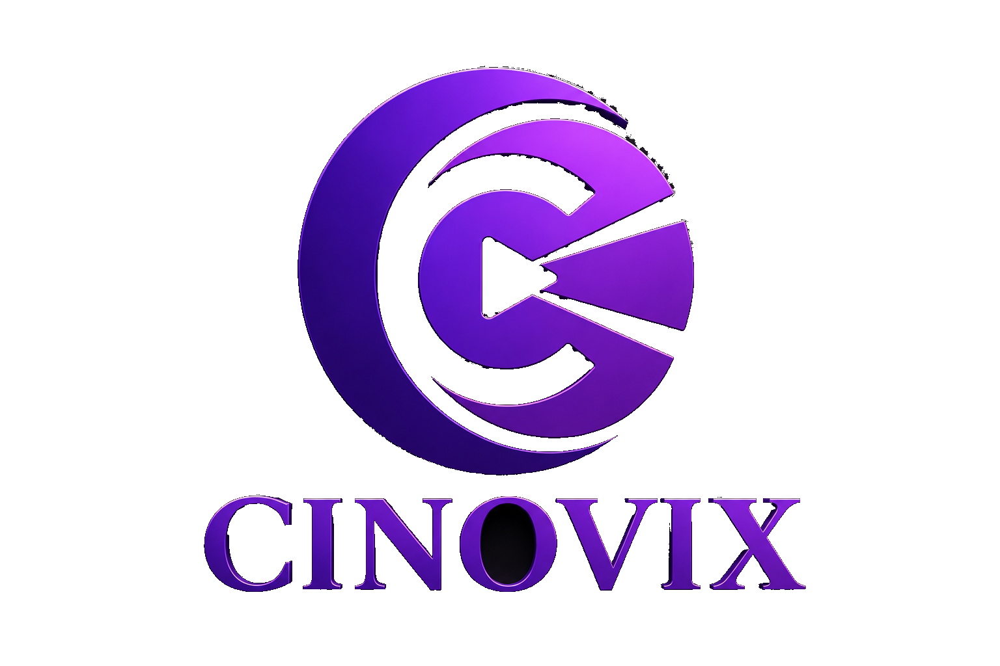

<div align="center">



# Cinovix

**Streaming that thinks with you.**

An AI-powered streaming platform that learns your taste, understands natural language search, and helps you discover what to watch next — across Bollywood, Hollywood, and regional cinema.

[Live Demo](#) · [Report Bug](#) · [Request Feature](#)

</div>

---

## 📖 Overview

Cinovix is a full-stack, AI-driven streaming platform built as a portfolio project to demonstrate production-grade engineering across the MERN stack, LLM integration, and modern frontend design. Unlike typical "Netflix clone" tutorials, Cinovix goes beyond a static content grid — it ships with a working AI recommendation engine, natural language semantic search, a subscription billing flow, and a fully custom design system.

> **Note:** Cinovix uses TMDB for content metadata (posters, cast, trailers) and does not stream copyrighted full-length films. This mirrors real-world constraints — actual movie licensing requires studio deals that are out of scope for a portfolio project. Trailer playback, AI recommendations, and all other features are fully functional with real data.

---

## ✨ Features

### Core Streaming Experience
- 🔐 **Authentication** — JWT-based signup/login with protected routes
- 👥 **Multi-Profile System** — up to 5 profiles per account with custom avatars
- 🎬 **Browse & Discover** — trending, regional cinema (Bollywood, Hollywood, Tollywood, Kollywood, Mollywood, Sandalwood), and platform-based browsing (Netflix, Prime Video, JioHotstar, ZEE5)
- 🔍 **Search** — keyword search with debouncing
- ▶️ **Watch Page** — trailer playback, cast, genres, similar titles, and ratings
- 📌 **My List** — save titles to watch later
- ⏱️ **Continue Watching** — resume trailers from where you left off
- ⭐ **Ratings & Reviews** — users can rate and review titles

### AI-Powered (Groq + LLM)
- 🎯 **AI Recommendation Engine** — analyzes watch history and saved titles to build a taste profile, then surfaces personalized recommendations
- 💬 **Semantic Search** — natural language queries like *"a sad emotional bollywood drama"* are parsed by an LLM into structured filters and matched against content

### Platform Features
- 💳 **Subscription Billing** — simulated payment gateway flow (Basic / Standard / Premium plans) demonstrating checkout, verification, and plan management architecture
- 🔔 **Notifications** — real-time-ish notification system for watchlist adds, subscription changes, and recommendations
- 🎨 **Custom Design System** — "Aurora" theme: a distinctive violet–magenta–cyan gradient identity, glassmorphism, and micro-interactions (not a Netflix clone visually)

---

## 🛠️ Tech Stack

**Frontend**
- React 19 (Vite)
- React Router
- Tailwind CSS v4
- Axios

**Backend**
- Node.js + Express
- MongoDB Atlas + Mongoose
- JWT Authentication (bcrypt password hashing)

**AI / LLM**
- Groq API (`openai/gpt-oss-120b`) — taste analysis & semantic query parsing

**External APIs**
- TMDB (The Movie Database) — content metadata, trailers, watch providers
- YouTube (iframe embed) — trailer playback

**Other**
- Simulated payment gateway (Razorpay-pattern architecture, mock implementation)

---

## 🏗️ Architecture

```
Cinovix/
├── client/                 # React frontend (Vite)
│   ├── src/
│   │   ├── components/     # Reusable UI components
│   │   │   ├── auth/
│   │   │   ├── content/
│   │   │   ├── navigation/
│   │   │   └── subscription/
│   │   ├── pages/          # Route-level pages
│   │   ├── context/        # Auth & Profile context providers
│   │   ├── services/       # API service layer (axios)
│   │   ├── hooks/          # Custom hooks (useDebounce, etc.)
│   │   └── data/
│   └── public/
│
├── server/                  # Node/Express backend
│   ├── config/               # DB connection
│   ├── models/                # Mongoose schemas
│   ├── controllers/            # Route handlers
│   ├── routes/                   # Express routers
│   ├── middleware/                 # Auth middleware
│   └── services/                    # TMDB, AI (Groq), subscription services
│
└── README.md
```

**Request flow example — AI Semantic Search:**

```
User types query → Frontend (Search.jsx)
  → POST /api/ai/search → aiController.js
    → Groq LLM parses query into { keywords, genres, language }
      → TMDB /discover endpoint filtered by parsed params
        → Results returned to frontend → rendered as content grid
```

---

## 🚀 Getting Started

### Prerequisites
- Node.js (v18+)
- MongoDB Atlas account (free tier)
- TMDB API key ([themoviedb.org](https://www.themoviedb.org/settings/api))
- Groq API key ([console.groq.com](https://console.groq.com))

### Installation

1. **Clone the repository**
   ```bash
   git clone https://github.com/AmitK241/Cinovix.git
   cd Cinovix
   ```

2. **Set up the backend**
   ```bash
   cd server
   npm install
   ```

   Create a `.env` file in `server/`:
   ```
   PORT=5000
   MONGO_URI=your_mongodb_atlas_connection_string
   JWT_SECRET=your_random_secret_string
   TMDB_API_KEY=your_tmdb_api_key
   GROQ_API_KEY=your_groq_api_key
   ```

   Start the server:
   ```bash
   npm run dev
   ```

3. **Set up the frontend**
   ```bash
   cd ../client
   npm install
   npm run dev
   ```

4. Open `http://localhost:5173` in your browser.

---

## 📡 API Overview

| Method | Endpoint | Description |
|---|---|---|
| POST | `/api/auth/signup` | Register a new user |
| POST | `/api/auth/login` | Login and receive JWT |
| GET | `/api/content/trending` | Get trending movies |
| GET | `/api/content/search` | Keyword search |
| GET | `/api/content/:id` | Movie details (trailer, cast, genres) |
| GET | `/api/content/:id/similar` | Similar titles |
| GET | `/api/content/providers` | List of streaming platforms |
| POST | `/api/ai/search` | Natural language semantic search |
| GET | `/api/ai/recommendations` | AI-generated personalized recommendations |
| GET/POST/DELETE | `/api/mylist` | Manage My List |
| GET/POST | `/api/watch-history` | Continue Watching progress |
| GET/POST/DELETE | `/api/reviews/:tmdbId` | Ratings & reviews |
| POST | `/api/subscription/create` \| `/verify` \| `/cancel` | Subscription flow |
| GET/PATCH/DELETE | `/api/notifications` | Notification system |

All routes except `/auth/*` require a `Bearer <token>` header.

---

## 🎨 Design Philosophy

Cinovix deliberately avoids visually copying existing streaming platforms. The **"Aurora"** design language uses a violet → magenta → cyan gradient system, glassmorphism panels, and subtle motion to create a distinct, AI-forward identity — reflecting that the product's core differentiator is intelligence, not just content browsing.

---

## 🧪 Known Limitations

- Full movie playback is intentionally out of scope (see note above) — trailers are used to demonstrate the video experience
- Subscription payments are simulated (no real payment gateway is charged)
- AI features depend on Groq API availability and free-tier rate limits

---

## 👤 Author

**Amit Kumar**
B.Tech CSE, MNNIT Allahabad
[GitHub](https://github.com/AmitK241) · [LinkedIn](https://linkedin.com/in/amit-kumar-3a602a289)

---

## 📄 License

This project is built for educational and portfolio purposes.